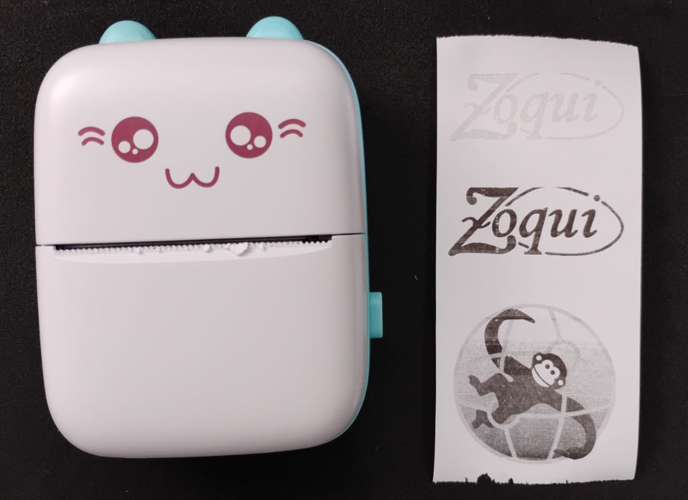

# Thermal Printer CLI (thermy.py)
thermy.py is a command-line interface for ultra-cheap mini thermal printers, commonly found on platforms like AliExpress. These compact printers — often shaped like cute animals such as cats — are inexpensive, highly portable, and surprisingly useful for everyday tasks such as printing receipts, notes, labels, QR codes, and more.

This tool brings full printing capability to the Linux terminal, allowing you to send both text and image files to supported Bluetooth-enabled thermal printers without needing a graphical interface or browser. Whether you’re working with a headless device like an Orange Pi or simply prefer the CLI, this script makes thermal printing accessible and powerful.

It is built upon the core protocol and communication logic of the kitty-printer web project and reuses its reliable Python-based Bluetooth communication module. Ideal for makers, POS experiments, DIY logging stations, or lightweight print automation projects.



## Features

- **Text Printing**: Print text with configurable font size
- **Image Printing**: Print PNG, JPG, and other image formats
- **File Support**: Print from text files
- **Bluetooth Discovery**: Scan for compatible thermal printers
- **Compatible Protocol**: Uses the same protocol as kitty-printer web project
- **Proven Bluetooth**: Reuses reliable Bluetooth communication from thermal_printer.py

## Supported Printer Models

The same models supported by the original projects:

- **XW Series**: XW001, XW002, XW003, XW004, XW005, XW006, XW007, XW008, XW009
- **JX Series**: JX001, JX002, JX003, JX004, JX005, JX006  
- **Other Models**: M01, PR02, PR07, GB01, GB02, GB03, GB04, LY01, LY02, LY03, LY10, AI01, GT01, MX10

## Requirements

- **Linux System**: Debian 12 (Orange Pi) or compatible
- **Python**: 3.11 or higher
- **Bluetooth**: Built-in or USB Bluetooth adapter
- **Thermal Printer**: One of the supported models

## Installation

### 1. System Dependencies

Install required system packages on Debian 12:

```bash
sudo apt update
sudo apt install python3 python3-pip python3-venv bluetooth bluez
```

### 2. Bluetooth Setup

Add your user to the Bluetooth group:

```bash
sudo usermod -a -G bluetooth $USER
# Log out and log back in, or use: newgrp bluetooth
```

Enable and start Bluetooth service:

```bash
# Start Bluetooth service
sudo systemctl start bluetooth

# Enable Bluetooth to start automatically
sudo systemctl enable bluetooth

# Check Bluetooth status
sudo systemctl status bluetooth
```

### 3. Python Environment

Create and activate a virtual environment:

```bash
python3 -m venv tp_env
source tp_env/bin/activate
```

### 4. Python Dependencies

Install Python packages:

```bash
pip install -r requirements.txt
```

### 5. Make Script Executable

```bash
chmod +x thermy.py
```

### 6. Verify Installation

Check if everything is working:

```bash
python3 thermy.py --check-requirements
```

## Usage

### System Check

Always run this first if you encounter issues:

```bash
python3 thermy.py --check-requirements
```

### Scan for Printers

Find available thermal printers:

```bash
python3 thermy.py --scan
```

This will show compatible printers with their Bluetooth addresses:

```
Found compatible printer: GB01: AA:BB:CC:DD:EE:FF
Found compatible printer: MX10: 28:03:08:58:C5:65
```

### Print Text

Print text directly:

```bash
python3 thermy.py --text "Hello, World!" --device AA:BB:CC:DD:EE:FF
```

Print text with custom font size:

```bash
python3 thermy.py --text "Large Text" --font-size 24 --device AA:BB:CC:DD:EE:FF
```

Print text with different alignments:

```bash
# Left-aligned text
python3 thermy.py --text "Left\nAligned\nText" --align left --device AA:BB:CC:DD:EE:FF

# Center-aligned text (default)
python3 thermy.py --text "Center\nAligned\nText" --align center --device AA:BB:CC:DD:EE:FF

# Right-aligned text
python3 thermy.py --text "Right\nAligned\nText" --align right --device AA:BB:CC:DD:EE:FF
```

Print text with inverted colors (white text on black background):

```bash
# Normal text: black text on white background
python3 thermy.py --text "Normal Text" --device AA:BB:CC:DD:EE:FF

# Inverted text: white text on black background
python3 thermy.py --text "HIGHLIGHTED\nTEXT" --invert --device AA:BB:CC:DD:EE:FF

# Large inverted label
python3 thermy.py --text "WARNING" --invert --font-size 32 --align center --device AA:BB:CC:DD:EE:FF
```

Print text with borders/frames:

```bash
# Thin border (1px)
python3 thermy.py --text "Thin\nBorder" --border 1 --device AA:BB:CC:DD:EE:FF

# Medium border (3px)
python3 thermy.py --text "Medium\nBorder" --border 3 --device AA:BB:CC:DD:EE:FF

# Thick border (5px)
python3 thermy.py --text "Thick\nBorder" --border 5 --device AA:BB:CC:DD:EE:FF

# Extra thick border (10px)
python3 thermy.py --text "VERY\nTHICK" --border 10 --device AA:BB:CC:DD:EE:FF

# Inverted text with border
python3 thermy.py --text "DANGER" --invert --border 5 --font-size 24 --device AA:BB:CC:DD:EE:FF
```

### Print Text File

Print contents of a text file:

```bash
python3 thermy.py --file document.txt --device AA:BB:CC:DD:EE:FF
```

### Print Image

Print an image file (PNG, JPG, etc.):

```bash
python3 thermy.py --image photo.jpg --device AA:BB:CC:DD:EE:FF
```

### Advanced Options

Print with custom speed and energy settings:

```bash
python3 thermy.py --text "High Quality" --speed 20 --energy 10000 --device AA:BB:CC:DD:EE:FF
```

- `--speed`: Print speed (10-90, lower = better quality, default: 35)
- `--energy`: Energy level (default: 8000)
- `--font-size`: Font size for text (default: 16)
- `--align`: Text alignment - left, center, or right (default: center)
- `--invert`: Invert colors - white text on black background
- `--border`: Add border frame around text - 1-10 pixels thick

## Command Reference

```bash
python3 thermy.py [OPTIONS]

Options:
  --scan, -s                    Scan for available printers
  --text TEXT, -t TEXT          Text to print
  --file FILE, -f FILE          Text file to print
  --image IMAGE, -i IMAGE       Image file to print
  --device ADDRESS, -d ADDRESS  Bluetooth device address
  --font-size SIZE             Font size for text (default: 16)
  --align {left,center,right}  Text alignment (default: center)
  --invert                     Invert colors: white text on black background
  --border {1-10}              Add border frame (1-10 pixels thick)
  --speed SPEED                Print speed 10-90 (default: 35)
  --energy ENERGY              Energy level (default: 8000)
  --check-requirements         Check system requirements
  --help, -h                   Show help message
```

## Examples

### Basic Usage

```bash
# Find your printer
python3 thermy.py --scan

# Print simple text
python3 thermy.py --text "Receipt #12345" --device AA:BB:CC:DD:EE:FF

# Print a file
python3 thermy.py --file receipt.txt --device AA:BB:CC:DD:EE:FF

# Print an image
python3 thermy.py --image logo.png --device AA:BB:CC:DD:EE:FF
```

### Advanced Usage

```bash
# Large bold text
python3 thermy.py --text "IMPORTANT NOTICE" --font-size 32 --device AA:BB:CC:DD:EE:FF

# Left-aligned multiline text
python3 thermy.py --text "HELLO\nWORLD\n!" --font-size 72 --align left --device AA:BB:CC:DD:EE:FF

# Right-aligned receipt header
python3 thermy.py --text "Receipt #12345\nDate: 2024-01-01" --align right --device AA:BB:CC:DD:EE:FF

# Inverted text for highlights and labels
python3 thermy.py --text "WARNING\nHOT SURFACE" --invert --font-size 32 --align center --device AA:BB:CC:DD:EE:FF

# Bordered warning label
python3 thermy.py --text "DANGER\nHIGH VOLTAGE" --border 5 --invert --font-size 24 --device AA:BB:CC:DD:EE:FF

# Simple framed receipt header
python3 thermy.py --text "RECEIPT" --border 3 --align center --font-size 20 --device AA:BB:CC:DD:EE:FF

# High quality image (slower)
python3 thermy.py --image photo.jpg --speed 20 --energy 10000 --device AA:BB:CC:DD:EE:FF

# Receipt with mixed styles (bordered header, normal items)
python3 thermy.py --text "STORE NAME" --font-size 24 --align center --border 3 --device AA:BB:CC:DD:EE:FF
python3 thermy.py --text "Item 1: $10\nItem 2: $15\nTotal: $25" --align left --device AA:BB:CC:DD:EE:FF
```

## Testing on Orange Pi

Since development and testing will be performed only on the Orange Pi (the only device with Bluetooth), here's how to test the functionality:

### 1. System Test

```bash
# Check all requirements
python3 thermy.py --check-requirements

# Test Bluetooth scanning
python3 thermy.py --scan
```

### 2. Printer Connection Test

```bash
# Test connection (replace with your printer's address)
python3 thermy.py --text "Connection Test" --device AA:BB:CC:DD:EE:FF
```

### 3. Feature Tests

```bash
# Test text printing
python3 thermy.py --text "Text Test - Hello World!" --device AA:BB:CC:DD:EE:FF

# Test file printing
echo "File test content" > test.txt
python3 thermy.py --file test.txt --device AA:BB:CC:DD:EE:FF

# Test image printing (create a small test image first)
python3 thermy.py --image test_image.png --device AA:BB:CC:DD:EE:FF

# Test different font sizes
python3 thermy.py --text "Small" --font-size 12 --device AA:BB:CC:DD:EE:FF
python3 thermy.py --text "Large" --font-size 24 --device AA:BB:CC:DD:EE:FF

# Test print quality settings
python3 thermy.py --text "High Quality" --speed 20 --energy 10000 --device AA:BB:CC:DD:EE:FF
```

### 4. Error Handling Tests

```bash
# Test with invalid device address
python3 thermy.py --text "Test" --device 00:00:00:00:00:00

# Test with non-existent file
python3 thermy.py --file nonexistent.txt --device AA:BB:CC:DD:EE:FF

# Test with invalid image
python3 thermy.py --image nonexistent.jpg --device AA:BB:CC:DD:EE:FF
```

## Troubleshooting

### Bluetooth Issues

**"Bluetooth support not available" Error:**
```bash
pip install bleak
```

**Useful Bluetooth utilities**

```bash

bluetoothctl list    # List local bluetooth interfaces
bluetoothctl         # Enter the bluetooth client - or use inline commands
power on             # Turn bluetooth interface on - or inline "bluetoothctl power on"
scan on              # Scan devices around - or inline "bluetoothctl scan on"
scan off             # Turn off the scan after get the device add ("bluetoothctl scan off")
info <mac add>       # Show specific device information "bluetoothctl info <mac add>"
pair <mac add>       # Pair with the device
trust <mac add>      # Trust the device
connect <mac add>    # Connect to the device
exit                 # Exit cli

# Example in a bash script:
  #!/usr/bin/bash
  bluetoothctl power on
  bluetoothctl trust <mac add>
  bluetoothctl disconnect <mac add>
  bluetoothctl connect <mac add> 

```

**"No compatible thermal printers found" during scan:**
- Make sure your printer is powered on
- Put the printer in pairing/discoverable mode
- Move closer to the printer
- Check if the printer model is supported

**Connection failures:**
- Verify the device address is correct
- Try restarting the Bluetooth service: `sudo systemctl restart bluetooth`
- Make sure you're in the bluetooth group: `groups $USER`

### Permission Issues

**"Permission denied" errors:**
```bash
sudo usermod -a -G bluetooth $USER
newgrp bluetooth  # Or log out and log back in
```

### Print Quality Issues

**Faded or unclear prints:**
- Increase energy level: `--energy 10000`
- Decrease speed: `--speed 20`
- Check if printer paper is fresh

**Image not printing correctly:**
- Make sure image file exists and is readable
- Try converting image to PNG first
- Check image resolution (too high resolution may cause issues)

## Technical Details

### Protocol Compatibility

This CLI script uses the **CRC8 Calculation** based on cat-protocol.ts:

### Bluetooth Implementation

The Bluetooth communication reuses the proven implementation from several projects for bluetooth thermal printers:

- **Service Discovery**: Automatic discovery of compatible printers
- **Characteristic Detection**: Automatic detection of write characteristics
- **Error Handling**: Comprehensive error handling for connection issues
- **UUID Support**: Multiple UUID variants for different printer models

### Image Processing

- **Automatic Resizing**: Images are automatically resized to fit paper width
- **Aspect Ratio**: Maintained during resizing
- **Centering**: Smaller images are centered on the paper
- **Format Support**: PNG, JPG, and other PIL-supported formats

## Library Versions

The script is designed for compatibility with:

- **Python**: 3.11+ (as available on Debian 12)
- **bleak**: 0.21.1+ (Bluetooth Low Energy)
- **Pillow**: 10.0.0+ (Image processing)

These versions are tested to work reliably on Debian 12 (Orange Pi) systems.
